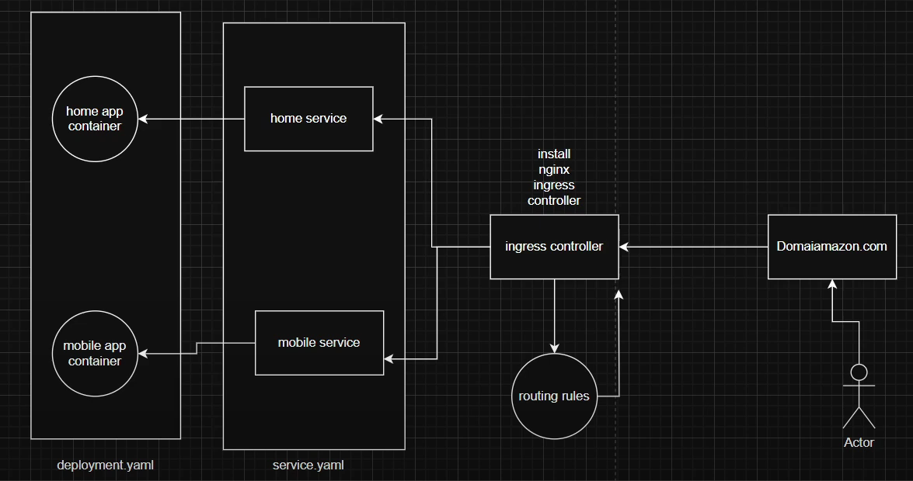
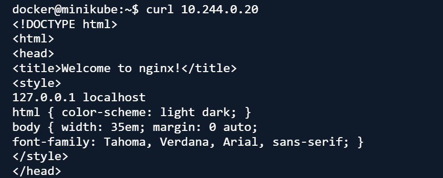

# Ingress Controller
An Ingress Controller is a Kubernetes component that manages external access to services inside the cluster, typically using HTTP/HTTPS. It acts as a reverse proxy and load balancer for routing traffic to the correct service based on rules defined in an Ingress resource.

# Why use Ingress controller
- Exposes multiple services via a single external IP
- Routes traffic using hostnames (e.g., example.com) or paths (/api, /shop, etc.)
- Supports SSL/TLS termination for secure HTTPS connections
- Provides load balancing across backend services
- Enables rewrites, redirects, and authentication

## How it Works

- Apps (Home & Mobile) run inside containers managed by Deployments.
- Each app has a Service to handle requests.
- Ingress Controller acts as the main entrance, deciding where traffic goes.
- Routing rules direct users (e.g., /home: Home Service, /mobile: Mobile Service).
- Users access the apps via a single domain e.g. amazon.com, and the Ingress Controller forwards them to the correct service.
## Steps to create Ingress controller 
### 1. create deployment.yaml file
```# apple-home Deployment
apiVersion: apps/v1
kind: Deployment
metadata:
  name: apple-home
spec:
  selector:
    matchLabels:
      app: apple-home
  template:
    metadata:
      labels:
        app: apple-home
    spec:
      containers:
      - name: apple-home
        image: httpd:alpine  # Uses Apache HTTP server
        ports:
        - containerPort: 80  # Exposes container on port 80
---
# apple-mobile Deployment
apiVersion: apps/v1
kind: Deployment
metadata:
  name: apple-mobile
spec:
  selector:
    matchLabels:
      app: apple-mobile
  template:
    metadata:
      labels:
        app: apple-mobile
    spec:
      containers:
      - name: apple-mobile
        image: nginx  # Uses Nginx web server
        ports:
        - containerPort: 80  # Exposes container on port 80

```
### 2. Create Service file 
```
# apple-home Service
apiVersion: v1
kind: Service
metadata:
  name: apple-home-service
  labels:
    app: apple-home-service
    env: devops
spec:
  selector:
    app: apple-home  # Matches pods with this label
  ports:
    - name: http
      protocol: TCP
      port: 80        # Exposes service on port 80
      targetPort: 80  # Forwards traffic to container's port 80
---
# apple-mobile Service
apiVersion: v1
kind: Service
metadata:
  name: apple-mobile-service
  labels:
    app: apple-mobile-service
    env: devops
spec:
  selector:
    app: apple-mobile  # Matches pods with this label
  ports:
    - name: http
      protocol: TCP
      port: 80        # Exposes service on port 80
      targetPort: 80  # Forwards traffic to container's port 80
```
### 3. Create Ingress file
```
apiVersion: networking.k8s.io/v1
kind: Ingress
metadata:
  name: apple-ingress
  labels:
    name: apple-ingress
spec:
  rules:
  - host: apple.com  # Domain for apple-home-service
    http:
      paths:
      - pathType: Prefix
        path: "/"  # Matches all requests
        backend:
          service:
            name: apple-home-service  # Routes traffic to this service
            port: 
              number: 80
  - host: apple.mobile.com  # Domain for apple-mobile-service
    http:
      paths:
      - pathType: Prefix
        path: "/"  # Matches all requests
        backend:
          service:
            name: apple-mobile-service  # Routes traffic to this service (fixed typo)
            port: 
              number: 80
```
### 4. Add, Commit and push it on remote repository
```
git add .
git commit -m "ingress"
git push origin
```
### 5. clone it on cloud shell /ubuntu machine
```
git pull origin
```
### 6. Go with that folder and craete deployments, services and ingress controller
```
kubectl apply -f deployment.yaml
kubectl apply -f service.yaml
kubectl apply -f ingress.yaml
```
### 7. check all running pods with detailed information in a Kubernetes cluster
```
kubectl get pod -o wide
```
###  Manually add an IP address and hostname mapping in the /etc/hosts file (Host-Based Name Resolution) 
```
vim /etc/hosts #write podIP and name save and close
```
### 8. Login into minikube machine 
```
minikube ssh
```
### 9. Check the service is responiding or not?
```
curl <podIP>
OR
curl <name>.com
```
## Result



